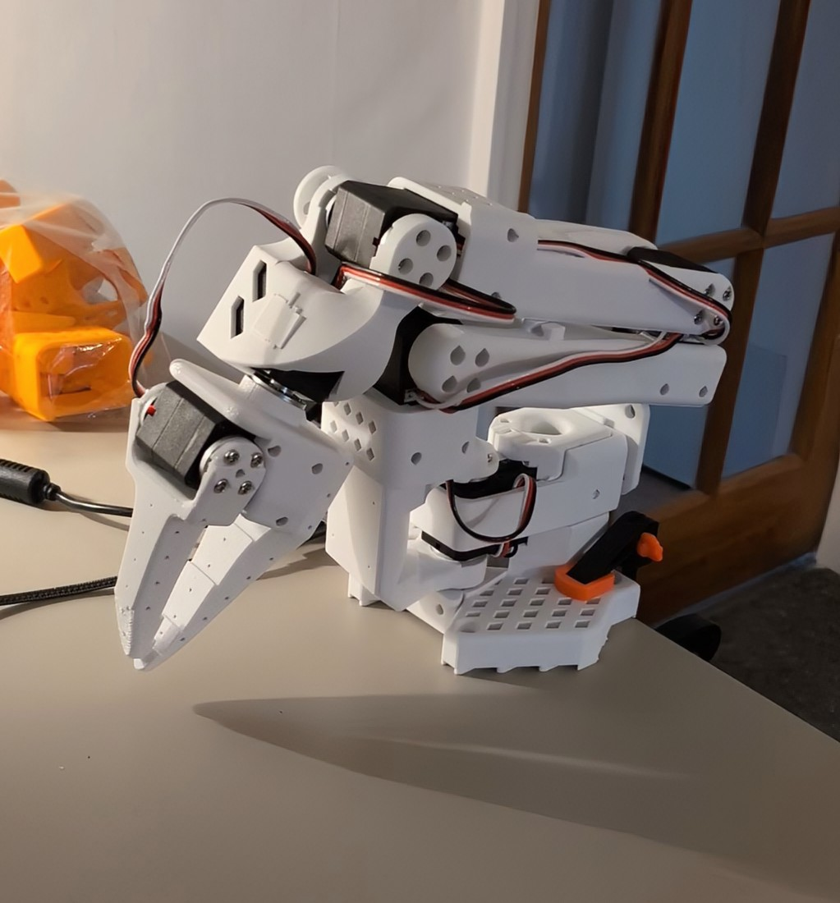

### Hello there 👋

I'm a **Machine Learning Research Engineer** - interested in everything 3D vision and robotics 🤖📷

- 🧑‍💻 I work on **3D representation learning** at [Loci](https://www.loci.ai/). We're creating a 3D-first VLM that uses different representations (such as pointclouds, multi-view images, voxels, meshes) to learn fine-grained details of 3D objects
  
- 🦾 I’m also learning how to use [VLA](https://openvla.github.io/) [models](https://diffusion-vla.github.io/) for data-efficient robot learning. I've setup the [SO-ARM100](https://github.com/TheRobotStudio/SO-ARM100) to use with the [LeRobot](https://github.com/huggingface/lerobot) library to perform pick and place tasks    
  
- 💬 Ask me about `vision encoders`, `robot learning`, `startups`
